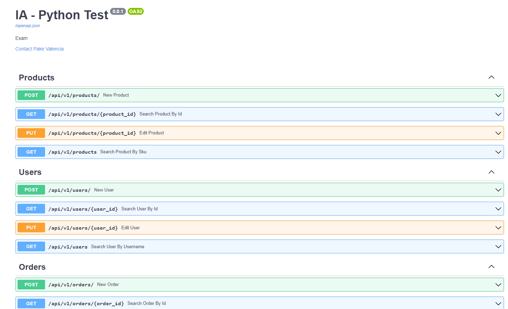
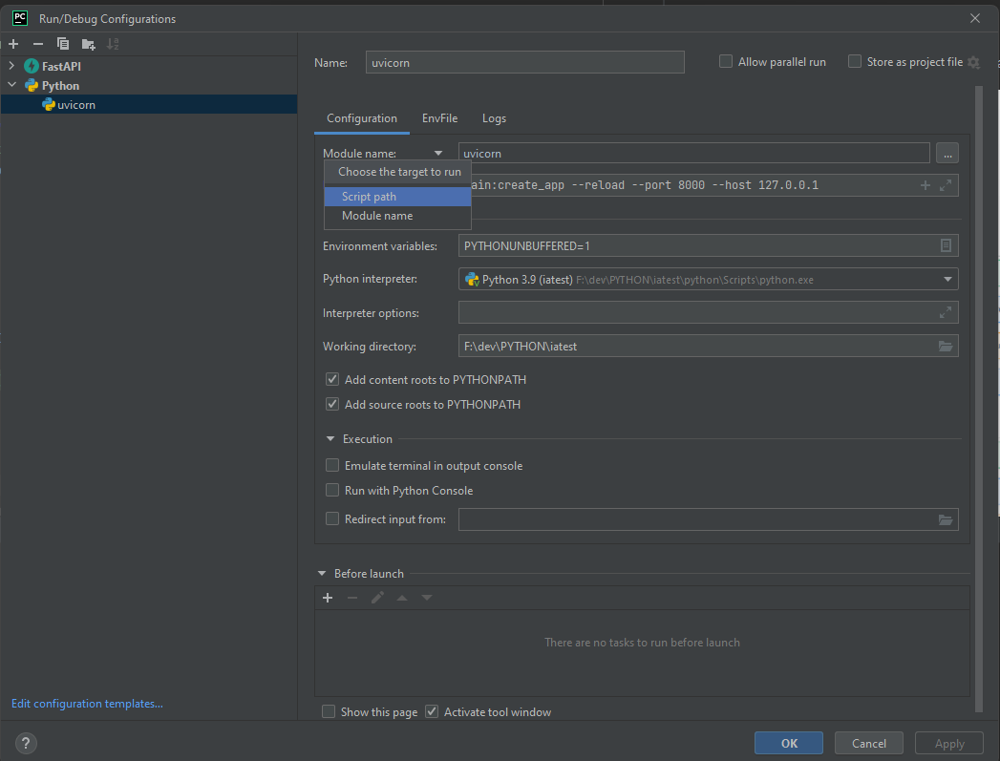

## IA Test

## Installation

<div class="termy">

```console
$ pip install fastapi
```

</div>

You will also need an ASGI server, for production such as <a href="https://www.uvicorn.org" class="external-link" target="_blank">Uvicorn</a> or <a href="https://gitlab.com/pgjones/hypercorn" class="external-link" target="_blank">Hypercorn</a>.

<div class="termy">

```console
$ pip install "uvicorn[standard]"
```

### Run it

Run the server with:

<div class="termy">

```console
$ uvicorn main:app --reload

INFO:     Uvicorn running on http://127.0.0.1:8000 (Press CTRL+C to quit)
INFO:     Started reloader process [28720]
INFO:     Started server process [28722]
INFO:     Waiting for application startup.
INFO:     Application startup complete.
```

</div>

<details markdown="1">
<summary>About the command <code>uvicorn main:app --reload</code>...</summary>

The command `uvicorn main:app` refers to:

* `main`: the file `main.py` (the Python "module").
* `app`: the object created inside of `main.py` with the line `app = FastAPI()`.
* `--reload`: make the server restart after code changes. Only do this for development.

</details>

### Interactive API docs

Now go to [http://127.0.0.1:8000/docs](<a href="http://127.0.0.1:8000/docs" class="external-link" target="_blank">)

You will see the automatic interactive API documentation (provided by <a href="https://github.com/swagger-api/swagger-ui" class="external-link" target="_blank">Swagger UI</a>):




### Run with PyCharm by jetbrains

1. change script path to module name
2. use _uvicorn_
3. in parameters write _main:create_app --reload --port 8000 --host 127.0.0.1_




### Note: Don't forget it, you need to create your virtual environment or interpreter in pycharm

## MySQL

* User Table
```console
create table users
(
    id        int auto_increment
        primary key,
    name      varchar(64)  not null,
    last_name varchar(64)  not null,
    username  varchar(32)  not null,
    password  varchar(254) not null,
    constraint users_id_uindex
        unique (id),
    constraint users_username_uindex
        unique (username)
);
```

* Product Table
```console
create table products
(
    id    int auto_increment
        primary key,
    sku   varchar(32)   not null,
    name  varchar(64)   not null,
    stock int default 0 null,
    constraint products_id_uindex
        unique (id),
    constraint products_sku_uindex
        unique (sku)
);

INSERT INTO iatest.products (id, sku, name, stock) VALUES (2, 'ABC123', 'test', 100);
INSERT INTO iatest.products (id, sku, name, stock) VALUES (3, 'string', 'string', 11);

```

* Order Table
```console
create table orders
(
    id     int auto_increment
        primary key,
    status int default 0 not null,
    constraint orders_id_uindex
        unique (id)
);

INSERT INTO iatest.orders (id, status) VALUES (1, 3);
```

* Order Detail Table(items)
```console
create table order_details
(
    id         int auto_increment
        primary key,
    order_id   int           not null,
    status     int default 0 not null,
    quantity   int default 1 not null,
    product_id int           not null,
    constraint order_details_id_uindex
        unique (id),
    constraint order_details_orders_id_fk
        foreign key (order_id) references orders (id),
    constraint order_details_products_id_fk
        foreign key (product_id) references products (id)
);

INSERT INTO iatest.order_details (id, order_id, status, quantity, product_id) VALUES (1, 1, 0, 1, 2);
```